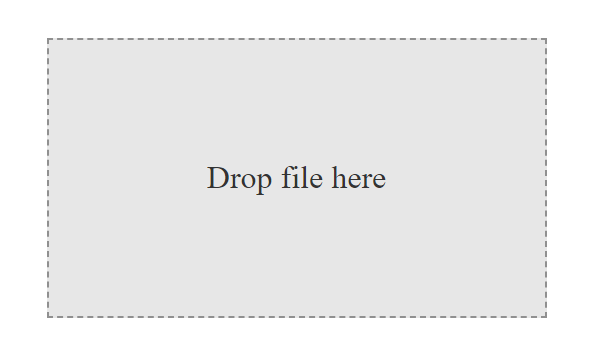

# Drag And Drop (DAD)

## Example

### html

    <label for="addFile" class="choose-file" data-content="Choose a File" multiple="true"></label>
    <input type="file" id="addFile" class="input-file" multiple="false" />

### javascript

    DAD.dragedUpload({
        element: document.querySelectorAll(".choose-file"),
        input: document.querySelector(".input-file"),
        start: () => console.log("Start"),
        end: (res, err) => {
            if(err === null){
                console.log("Res ::: ", res);
            }else {
                console.log("Error ::: ", err);
            }
        }
    });

    DAD.fileChange({
        element: document.querySelectorAll(".input-file"),
        start: () => console.log("Start"),
        end: (res, err) => {
            if(err === null){
                console.log("Res ::: ", res);
            }else {
                console.log("Error ::: ", err);
            }
        }
    });

When we bring the file closer to the installation area a new class is added to the installation section called ***"dragover"***, with which we can shape the installation area․

    DAD.draggableContex(document.querySelectorAll(".navbar"));