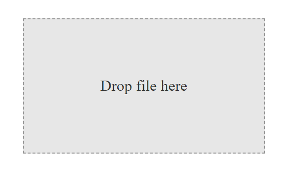
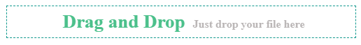

# Drag And Drop (DAD)

## Example

### Package connection

    

    1. Your Path + /draganddrop.js
    or
    2. Your Path + /draganddrop.min.js

### html

    <label for="addFile" class="input-label" data-content="Choose a File" multiple="true"></label>
    <input type="file" id="addFile" class="input-file" multiple="false" />

### javascript

    DAD.draggedUpload({
        element: document.querySelectorAll(".input-label"),
        input: document.querySelector(".input-file"),
        start: () => console.log("Start"),
        end: (res, err) => {
            if(err === null){
                console.log("Res ::: ", res);
            }else {
                console.log("Error ::: ", err);
            }
        }
    });

    DAD.fileChange({
        element: document.querySelectorAll(".input-file"),
        start: () => console.log("Start"),
        end: (res, err) => {
            if(err === null){
                console.log("Res ::: ", res);
            }else {
                console.log("Error ::: ", err);
            }
        }
    });

When we bring the file closer to the installation area a new class is added to the installation section called ***"dragover"***, with which we can shape the installation area․

    DAD.draggableContext(document.querySelectorAll(".navbar"));

### Chunk Upload Example

#### FileUpload

    let imageId = 10;
    Chunk.uploader({
        chunkSize: 1000000,
        url: "your_url",
        file: res.files[0].file,
        uniqueID: 20, // or false
        keys: {
            key: "file",
            end: 'end',
            order: 'order'
        },
        form: {
            'imageId': imageId
        },
        headers: {
            "Authorization" : "your_token" 
        },
        start: () => console.log('started upload'),
        end: res => console.log('finished', res),
        onError: err => console.log('error', err),
        progress: percent => console.log(percent)
    });

#### Get Chunks

    Chunk.getChunks(res.files[0].file);